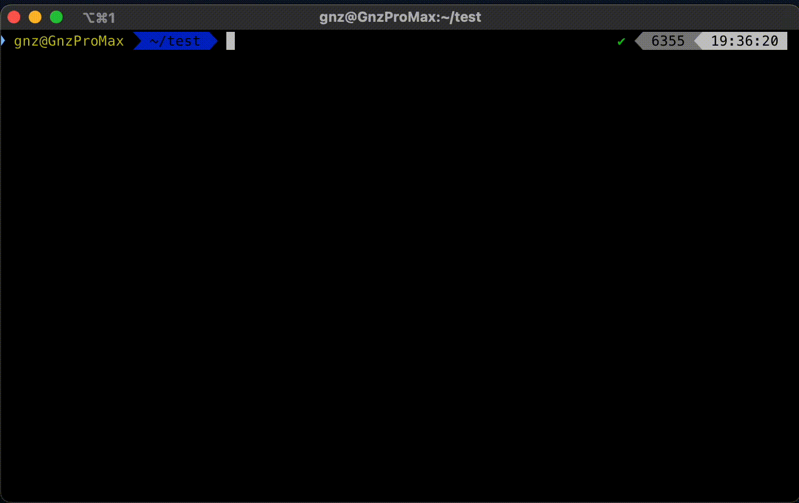

# iShinobu - i忍
Ishinobu is a modular triage data collection tool for macOS intended to be used by incident responders, security analysts, and forensic investigators.
It is designed to collect system information and logs from various sources, such as system logs, network connections, running processes, and more.

Once logs are collected in a JSON format, you can use [ishinobu2elk](https://github.com/gnzdotmx/ishinobu2elk) to visualize logs in ELK for a faster investigation.

Main features include:
- The collected data can be exported in JSON or CSV format.
- All events are logged to a file, and the output is compressed into a single file for easy sharing.
- Logs are timestamped under the same key, which is useful for correlating events across different sources, or just to have a chronological view of the collected data.
- The tool is modular, which means that new data collection modules can be easily added.
- The tool is designed to be run in parallel, which makes it faster to collect data from multiple sources.
- The tool is designed to be run in a macOS environment, but it can be easily adapted to other platforms.
- Developers have a way to create a template for new modules.




## Compilation
Compile and execute the `ishinobu` binary in the target machine.
```bash
git clone https://github.com/gnzdotmx/ishinobu.git
cd ishinobu/ishinobu
go build -o ishinobu main.go
```

### Troubleshooting
If the previous `ishinobu` binary is killed by the system, include `-ldflags -s` when building the binary. 
By default on Darwin the linker will invoke dsymutil to put the debug info directly into the executable. This invocation of dsymutil is disabled by the linker's -s option.
```
go build -o ishinobu -ldflags -s main.go
```

## Usage
Locate `ishinobu` binary in the target host and execute it as root.
```bash
sudo ./ishinobu -m all -e json -p 4 -v 1
```
### Verbosity Levels

The application supports two verbosity levels:

- `1`: Info and Error
- `2`: Debug, Info, and Error

## Modules
- **asl**: Collects and parses logs from Apple System Logs (ASL).
- **auditlogs**: Collects information from the macOS audit logs.
- **chrome**: Collects and parses chrome history, downloads, extensions, popup settings, and profiles.
- **firefox**: Collects and parses Firefox browser history, downloads, and extensions.
- **listfiles**: Collects metadata for files and folders on disk (Warning: This module can take a while to complete based on the amount of files in the system).
- **lsof**: Collects information about open files, network connections, and processes.
- **netcfgplists**: Collects information about network configurations from plist files.
- **autostart**: Collects and parses autostart items.
- **browsercookies**: Collects and parses browser cookies (Chrome, Firefox).
- **netstat**: Collects information about current network connections.
- **nettop**: Collects the amount of data transferred by processes and network interfaces.
- **notificationcenter**: Collects and parses notifications from NotificationCenter.
- **ps**: Collects the list of running processes and their details.
- **terminalhistory**: Collects and parses terminal histories.
- **unifiedlog**: Collects information from the macOS unified logs.
	- [Enabled] Command line activity - Run with elevated privileges.
	- [Enabled] SSH activity - Remmote connections.
	- [Enabled] Screen sharing activity - Remote desktop connections.
	- [Enabled] Session creation or deletion.
	- [Disabled] System logs - Kernel messages.
	- [Disabled] Security logs - Authentication attempts.
	- [Disabled] Network logs - Network activities.
	- [Disabled] User activity logs - Login sessions.
	- [Disabled] File system events - Disk mounts.
	- [Disabled] Configuration changes - Software installations.
	- [Disabled] Hardware events - Peripheral connections.
	- [Disabled] Time and date changes - System time adjustments.


# Guide for developers
- [DEV.md](./DEV.md)
