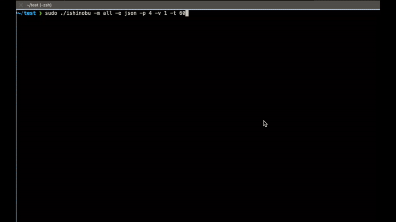

# 🥷 iShinobu - i忍
Ishinobu is a modular triage data collection tool for macOS intended to be used by incident responders, security analysts, and forensic investigators.
It is designed to collect system information and logs from various sources, such as system logs, network connections, running processes, and more.

Once logs are collected in a JSON format, you can use [ishinobu2elk](https://github.com/gnzdotmx/ishinobu2elk) to visualize logs in ELK for a faster investigation.

## ✨ Main Features
- The collected data can be exported in JSON or CSV format.
- All events are logged to a file, and the output is compressed into a single file for easy sharing.
- Logs are timestamped under the same key, which is useful for correlating events across different sources, or just to have a chronological view of the collected data.
- The tool is modular, which means that new data collection modules can be easily added.
- The tool is designed to be run in parallel, which makes it faster to collect data from multiple sources.
- The tool is designed to be run in a macOS environment, but it can be easily adapted to other platforms.
- Developers have a way to create a template for new modules.




## 🛠️ Compilation
Compile and execute the `ishinobu` binary in the target machine.
```bash
git clone https://github.com/gnzdotmx/ishinobu.git
cd ishinobu
go build -o ishinobu cmd/ishinobu/main.go
```

For cross-compilation from `Mx` Chips to Intel Macs, use the following command:
```bash
GOOS=darwin GOARCH=amd64 go build -o ishinobu -ldflags -s cmd/ishinobu/main.go
```

### 🔍 Troubleshooting
If the previous `ishinobu` binary is killed by the system, include `-ldflags -s` when building the binary. 
By default on Darwin the linker will invoke dsymutil to put the debug info directly into the executable. This invocation of dsymutil is disabled by the linker's -s option.
```
go build -o ishinobu -ldflags -s cmd/ishinobu/main.go
```

## 🚀 Usage
Locate `ishinobu` binary in the target host and execute it as root.
```bash
sudo ./ishinobu -m all -e json -p 4 -v 1 -t 60
```

### 📊 Verbosity Levels

The application supports two verbosity levels:

- `1`: Info and Error
- `2`: Debug, Info, and Error

### ⏱️ Timeout

The application supports a timeout for each module.

- `0`: No timeout
- `60`: 60 seconds

## 📦 Modules
- **📱 appstore**: Collects App Store installation history and receipt information.
- **📜 asl**: Collects and parses logs from Apple System Logs (ASL).
- **🔍 auditlogs**: Collects information from the macOS audit logs.
- **🌐 chrome**: Collects and parses chrome history, downloads, extensions, accessed domains by extensions, popup settings, and profiles.
- **📊 coreanalytics**: Collects and parses coreanalytics data.
- **🦊 firefox**: Collects and parses Firefox browser history, downloads, and extensions.
- **📂 listfiles**: Collects metadata for files and folders on disk (Warning: This module can take a while to complete based on the amount of files in the system).
- **📝 lsof**: Collects information about open files, network connections, and processes.
- **🔌 netcfgplists**: Collects information about network configurations from plist files.
- **🚀 autostart**: Collects and parses autostart items.
- **🍪 browsercookies**: Collects and parses browser cookies (Chrome, Firefox).
- **🌐 netstat**: Collects information about current network connections.
- **📊 nettop**: Collects the amount of data transferred by processes and network interfaces.
- **🔔 notificationcenter**: Collects and parses notifications from NotificationCenter.
- **⚙️ ps**: Collects the list of running processes and their details.
- **🔒 quarantineevents**: Collects and parses QuarantineEventsV2 database.
- **👁️ quicklook**: Collects and parses QuickLook database.
- **🧭 safari**: Collects and parses safari history, downloads, and extensions.
- **🔍 spotlight**: Collects and parses Spotlight shortcuts data.
- **🔑 ssh**: Collects and parses SSH known_hosts and authorized_keys files.
- **📋 syslog**: Collects and parses system.log files.
- **💻 systeminfo**: Collects and parses system information.
- **🖥️ terminal**: Collects and parses Terminal.app saved state and terminal histories.
- **📚 unifiedlog**: Collects information from the macOS unified logs.
	- [✅] Command line activity - Run with elevated privileges. Enabled by default.	
	- [✅] SSH activity - Remmote connections. Enabled by default.
	- [✅] Screen sharing activity - Remote desktop connections. Enabled by default.
	- [✅] Session creation or deletion. Enabled by default.
	- [❌] System logs - Kernel messages. Disabled by default.
	- [❌] Security logs - Authentication attempts. Disabled by default.
	- [❌] Network logs - Network activities. Disabled by default.
	- [❌] User activity logs - Login sessions. Disabled by default.
	- [❌] File system events - Disk mounts. Disabled by default.
	- [❌] Configuration changes - Software installations. Disabled by default.
	- [❌] Hardware events - Peripheral connections. Disabled by default.
	- [❌] Time and date changes - System time adjustments. Disabled by default.
- **👥 users**: Collects and parses user information.
- **🔐 utmpx**: Collects and parses utmpx login records.

# 👨‍💻 Guide for developers
- [DEV.md](./DEV.md)
